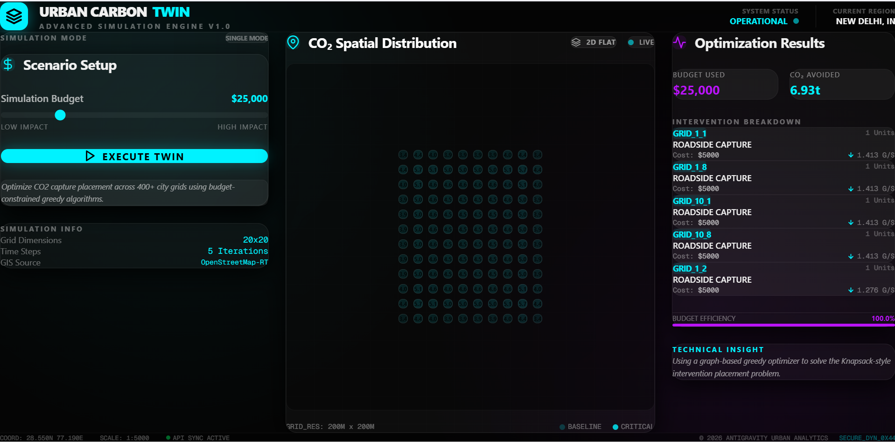
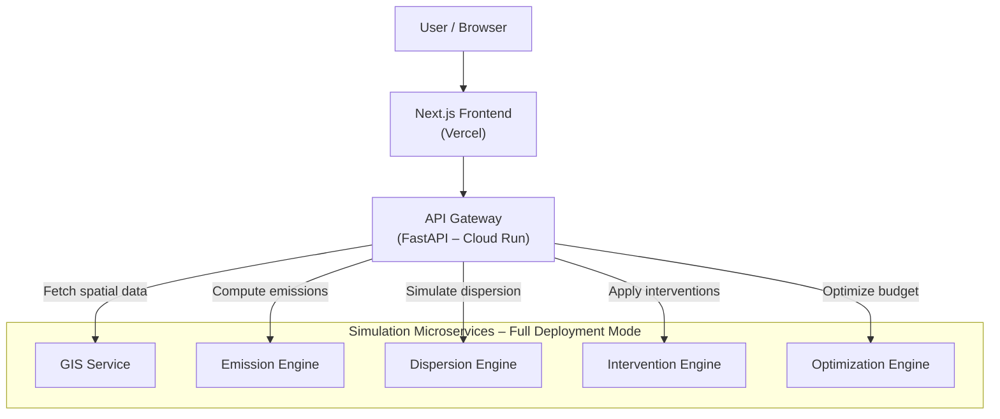

# Urban Carbon Twin 🏙️🌱
### A Digital Twin Platform for Urban CO₂ Modeling & Mitigation

---

## 📌 Project Overview

**Urban Carbon Twin** is a microservices-based **digital twin platform** designed to model, simulate, and optimize **CO₂ emissions, dispersion, and mitigation strategies** in urban environments.

The platform enables planners, researchers, and sustainability teams to **analyze urban carbon dynamics digitally**, test mitigation strategies virtually, and make **data-driven decisions** before real-world deployment.
---

## 🌍 Live Demo

🚀 **Urban Carbon Twin Dashboard**  
👉 https://urban-carbon-twin.vercel.app/

## 📊 Dashboard Preview
[](https://urban-carbon-twin.vercel.app/)


## 🌍 Why Urban Carbon Twin

Modern cities face complex challenges related to:
- **Traffic-driven emissions** and high-density hotspots.
- **Micro-climatic dispersion** patterns that vary by street layout.
- **High costs** and risks associated with real-world infrastructure trials.

Urban Carbon Twin provides a **virtual experimentation environment** where different emission scenarios and mitigation strategies can be tested safely and efficiently.

---

## 🧠 System Architecture

The project follows a **modular, cloud-native architecture** designed for scalability and clear separation of concerns.

### 🌐 High-Level Flow


### 🧩 Data Orchestration
User requests initiated from the Next.js frontend are routed through a FastAPI-based **API Gateway**. The gateway orchestrates spatial processing, emission modeling, dispersion simulation, intervention evaluation, and optimization services before returning aggregated, decision-ready results to the frontend.

---

## 🚀 Scalability & Deployment Modes

The system is designed to scale from **Pilot Zones** to **City-Wide** deployments using a phased approach.

| Mode | Execution Model | Use Case |
| :--- | :--- | :--- |
| **🟢 Cloud (MVP)** | Frontend on Vercel, API Gateway on Cloud Run. | Rapid demos, government reviews, lightweight simulations. |
| **🔵 Local (Full)** | Multi-container Docker Compose setup. | Full-scale research, heavy computation, data-intensive modeling. |

> [!NOTE]
> For the MVP deployment, a lightweight simulation layer is executed within the API Gateway. The dedicated microservices are activated when high-fidelity modeling is required.

---

## 🛠️ Quick Start

### Prerequisites
- [Docker Desktop](https://www.docker.com/products/docker-desktop)
- [Node.js & npm](https://nodejs.org/) (for local frontend dev)

### Running Locally (Full Simulation Mode)
1. **Clone the Repository**
   ```bash
   git clone https://github.com/your-username/urban-carbon-twin.git
   cd urban-carbon-twin
   ```
2. **Start All Services**
   ```bash
   docker compose up --build
   ```
3. **Access the Application**
   - **Frontend Dashboard**: [http://localhost:3000](http://localhost:3000)
   - **API Documentation**: [http://localhost:8005/docs](http://localhost:8005/docs)

---

## 🧪 API Usage

Interact directly with the simulation engine via the API Gateway.

**Endpoint:** `POST /scenario`  
**Description:** Executes a full carbon modeling pipeline based on budget and parameters.

**Example Request:**
```json
{
  "budget": 50000,
  "interventions": ["green_wall", "roadside_capture"] 
}
```

---

## 📊 Core Features

- **3D Grid Visualization**: Interactive city grid with tilt/rotate using Three.js/Next.js.
- **Scenario Optimization**: Budget-aware intervention placement (AI-driven).
- **Spatial Analytics**: GIS-integrated adjacency graphs for pollution dispersion.
- **Glassmorphism UI**: Premium, modern dashboard aesthetics.

---

## 📜 License & Team

- **Team Name:** [Your Team Name]
- **Project Theme:** Digital Twin for Urban CO₂ Capture  
- **License:** Developed for academic and demonstration purposes (SIH 2024 candidate).

---
> [!TIP]
> **One-Line Architecture Summary**: “The Urban Carbon Twin uses a cloud-native microservice architecture with a Vercel-hosted Next.js frontend and a Google Cloud Run–based API Gateway, enabling scalable and modular urban carbon simulation.”