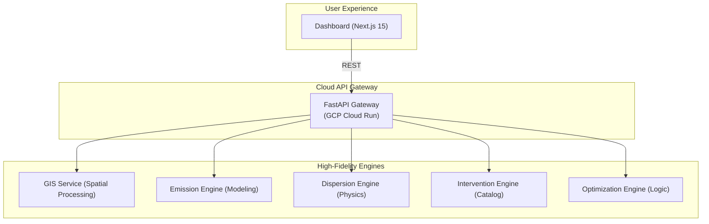

# Urban Carbon Twin 🏙️🌌✨
### An Advanced Digital Twin Platform for Urban CO₂ Modeling & Optimization

---

## 📌 Project Vision

**Urban Carbon Twin** is a high-fidelity, microservices-powered **digital twin platform** engineered to simulate, visualize, and optimize urban carbon sequestration. By creating a precise virtual replica of urban environments, the platform empowers city planners and environmental teams to test mitigation strategies in a **low-risk, high-intelligence environment** before real-world implementation.

---

## ⚡ Key Pillars

| 🧩 Visibility | 🧠 Intelligence | 📈 Optimization |
| :--- | :--- | :--- |
| **Real-time GIS Sync** integrates spatial data into a high-performance 3D dashboard. | **Physics-based Dispersion** models the micro-climatic flow of CO₂ across street layouts. | **Cost-Aware Interventions** use AI to find the most efficient budget allocation. |

---

## 🌌 The "Dream Dashboard" Aesthetic

The platform features a **premium, glassmorphic UI** inspired by high-end Fintech and Staking platforms, designed for maximum decision-making clarity and visual impact.

- **Deep Space Palette**: A sophisticated black-purple base with vibrant **Violet & Indigo** accents.
- **Glassmorphism**: Extensive use of `backdrop-blur` and semi-transparent layers for a modern, tactile feel.
- **Tailwind CSS v4**: Built with the latest **CSS-first architecture** for high performance and design consistency.
- **Cyber-Spatial Visualization**: 3D grid volumetrics that clearly represent CO₂ concentrations with glowing intensity nodes.

---

## 🧠 System Architecture

Urban Carbon Twin utilizes a **decoupled microservice architecture** for maximum scalability and reliability.



### 🛠️ Service Directory

| Service | Responsibility | Technology |
| :--- | :--- | :--- |
| **Frontend** | Premium Dashboard UI & 3D Visuals | Next.js 15, Tailwind v4, Lucide |
| **API Gateway** | Request Orchestration & Security | FastAPI, GCP Cloud Run |
| **GIS Service** | Street Layout & Building Footprints | Python, GeoJSON |
| **Emission Engine**| Traffic & Point-source computation | Python, Scientific Computing |
| **Dispersion Engine**| CO₂ Micro-flow simulation | Python, Physics Models |
| **Optimization Engine**| Budget allocation logic | Python, Linear Optimization |

---

## 🚀 Technical Stack

- **Frontend**: Next.js 15, React 19, **Tailwind CSS v4**, Lucide-React.
- **Backend**: Python 3.12, FastAPI, Pydantic, NumPy.
- **Infrastructure**: Docker, Docker Compose, Google Cloud Run, Vercel.
- **Architecture**: RESTful Microservices, Geo-spatial Data Processing.

---

## 🛠️ Quick Start

### 1. Prerequisites
- **Docker Desktop** installed.
- **Node.js 20+** (if running frontend separately).

### 2. Launch Local Environment
Clone the repo and spin up the entire cluster:
```bash
git clone https://github.com/PrayasNASA/urban-carbon-twin.git
cd urban-carbon-twin
docker compose up --build
```

### 3. Access Portals
- **🌍 Frontend**: [http://localhost:3000](http://localhost:3000)
- **⚙️ API Gateway**: [http://localhost:8005/docs](http://localhost:8005/docs)
- **📍 GIS Service**: [http://localhost:8000/docs](http://localhost:8000/docs)

---

## 🧪 Interactive Simulation

Use the dashboard to execute complex carbon sequestration scenarios:
1. **Define Budget**: Adjust the glowing slider to set your target investment.
2. **Synchronize Nodes**: The system fetches real-time GIS data for urban nodes.
3. **Run Simulation**: The engine calculates emissions, simulates dispersion, and finds the optimal intervention plan.
4. **Compare Mode**: Toggle comparison to test "Baseline" vs. "Optimized" strategies.

---

## 📜 License & Governance

- **Project Status**: ACTIVE - Developed for strategic urban resilience modeling.
- **Theme**: Digital Twin for Sustainability & Decarbonization.
- **Context**: SIH 2024 Candidate / Technical Demonstration.

---
> [!TIP]
> **One-Line Architecture Summary**: “A cloud-native microservice ensemble synchronizing spatial intelligence with physical modeling to deliver actionable urban carbon mitigation strategies.”
