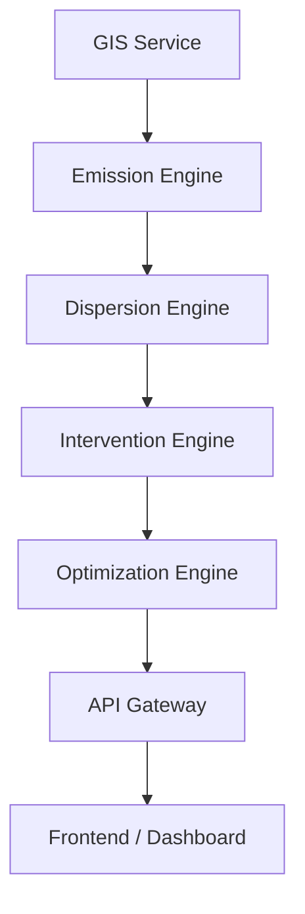

# Urban Carbon Twin  
### A Digital Twin Platform for Urban CO₂ Modeling & Mitigation

---

## 📌 Project Overview

**Urban Carbon Twin** is a microservices-based **digital twin platform** designed to model, simulate, and optimize **CO₂ emissions, dispersion, and mitigation strategies** in urban environments.

The platform enables planners, researchers, and sustainability teams to **analyze urban carbon dynamics digitally**, test mitigation strategies virtually, and make **data-driven decisions** before real-world deployment.

---

## 🌍 Why Urban Carbon Twin

Modern cities face complex challenges related to:
- Traffic-driven emissions
- Dense urban infrastructure
- Limited space for physical experimentation
- High cost of trial-and-error interventions

Urban Carbon Twin provides a **virtual experimentation environment** where different emission scenarios and mitigation strategies can be tested safely and efficiently.

---

## 🎯 Core Objectives

- Create a **grid-based digital representation** of an urban area
- Model **CO₂ emissions** from roads, buildings, and baseline sources
- Simulate **pollution dispersion** across spatial neighborhoods
- Apply **carbon capture and mitigation interventions** digitally
- Optimize intervention placement under **budget constraints**
- Provide a **single scenario API** for dashboards and analytics tools

---

## 🧠 Platform Architecture

The system is built using **loosely coupled microservices**, each responsible for a specific domain:

### 🗺️ GIS Service
- Converts raw spatial data into uniform city grids
- Generates road networks, buildings, and adjacency graphs
- Acts as the spatial backbone of the digital twin

### 🔥 Emission Engine
- Calculates CO₂ emissions per grid
- Uses road density, traffic intensity, and baseline parameters

### 🌫️ Dispersion Engine
- Simulates how pollution spreads across neighboring grids
- Models spatial diffusion using adjacency relationships

### 🌱 Intervention Engine
- Applies mitigation actions such as:
  - Roadside capture units
  - Green buffers
  - Localized reduction strategies
- Evaluates post-intervention concentration changes

### 📊 Optimization Engine
- Selects the most effective intervention plan
- Respects budget constraints and cost-effectiveness
- Produces an optimized action plan per grid

### 🚪 API Gateway
- Orchestrates all services
- Exposes a unified **scenario API**
- Enables easy frontend and dashboard integration

---

## 🧩 Grid-Based Digital Twin Concept

The **grid** is the core entity across the entire system.

Each grid represents:
- Emission intensity
- Pollution concentration
- Dispersion behavior
- Intervention impact
- Optimization priority

This approach ensures:
- Consistent data flow across services
- Scalable simulations for large cities
- Easy visualization via heatmaps and dashboards

---

## 🔁 Scenario Simulation Workflow

1. **Spatial Modeling**  
   Urban area is converted into grids with spatial metadata

2. **Emission Calculation**  
   CO₂ emissions are computed per grid

3. **Dispersion Simulation**  
   Pollution spreads across neighboring grids

4. **Intervention Application**  
   Mitigation strategies are applied digitally

5. **Optimization**  
   Best intervention plan is selected under constraints

6. **Unified Output**  
   Complete scenario results returned via API

---

## 📊 Outputs & Insights

The platform produces:
- Grid-level CO₂ concentration maps
- Pollution hotspot identification
- Before-and-after intervention comparison
- Budget vs impact optimization results
- Structured data for visualization tools

---

## 🏗️ Deployment & Scalability

- Fully containerized using **Docker**
- One-command startup using Docker Compose
- Cloud-ready and Kubernetes-compatible
- Modular design allows future integration with live sensors

---

## 🌱 Impact & Use Cases

- Urban sustainability planning
- Smart city simulations
- Environmental research and policy modeling
- Academic and research demonstrations
- Decision-support dashboards

---

## 🏁 Conclusion

Urban Carbon Twin is a **simulation-first digital twin platform** that brings clarity, precision, and scalability to urban CO₂ management.

By enabling virtual experimentation at city scale, the platform helps teams move from assumptions to **evidence-based decisions**, accelerating the path toward sustainable urban futures.

---

**Project Type:** Digital Twin • Urban Analytics • Clean-Tech Platform  
**Status:** Modular, scalable, and production-ready


## 🧠 System Architecture (High Level)

The Urban Carbon Twin platform is designed as a **microservices-based architecture**, where each component performs a well-defined role in the overall simulation pipeline.

GIS Service
↓
Emission Engine
↓
Dispersion Engine
↓
Intervention Engine
↓
Optimization Engine
↓
API Gateway
↓
Frontend / Dashboard


### Architecture Principles

- Each component is deployed as an **independent microservice**
- Services communicate through **well-defined APIs**
- Enables **horizontal scalability** and fault isolation
- Ensures **clean separation of concerns**
- Allows independent development, testing, and deployment

This architecture supports complex urban simulations while remaining modular, extensible, and production-ready.


## 🧩 Microservices Breakdown

The Urban Carbon Twin platform is composed of multiple **loosely coupled microservices**, each responsible for a specific domain within the urban CO₂ simulation pipeline.

---

### 1️⃣ GIS Service  
**Purpose:** Spatial foundation of the digital twin

**Responsibilities:**
- Generates a grid-based representation of the city
- Maps roads and buildings to individual grids
- Computes spatial metrics:
  - Road length per grid
  - Building density
  - Average building height
- Builds the grid adjacency graph used for dispersion modeling

**Port:** `8000`

---

### 2️⃣ Emission Engine  
**Purpose:** Source modeling

**Responsibilities:**
- Consumes grid metadata from the GIS Service
- Computes grid-level CO₂ emissions
- Uses configurable emission factors for flexibility
- Produces emission intensity per grid

**Port:** `8001`

---

### 3️⃣ Dispersion Engine  
**Purpose:** Pollution movement modeling

**Responsibilities:**
- Uses the grid adjacency graph from the GIS Service
- Simulates CO₂ spread across neighboring grids
- Applies diffusion and decay factors
- Outputs spatially adjusted concentration values

**Port:** `8002`

---

### 4️⃣ Intervention Engine  
**Purpose:** Action simulation

**Responsibilities:**
- Applies digital carbon-capture strategies, including:
  - Roadside capture units
  - Vertical gardens
  - Biofilters
- Supports multiple interventions per grid
- Computes post-intervention pollution concentrations

**Port:** `8003`

---

### 5️⃣ Optimization Engine  
**Purpose:** Decision intelligence

**Responsibilities:**
- Performs budget-aware optimization
- Selects optimal intervention placement across grids
- Maximizes CO₂ reduction per unit cost
- Uses an explainable greedy optimization approach

**Port:** `8004`

---

### 6️⃣ API Gateway  
**Purpose:** Single entry point

**Responsibilities:**
- Orchestrates all backend services
- Executes end-to-end scenario simulations
- Aggregates results into a unified response
- Exposes a scenario-based API for frontends and demos

**Port:** `8005`

---

## 🚀 Tech Stack

### Backend
- **Python 3.11**
- **FastAPI**
- **GeoPandas / Shapely** (GIS & spatial processing)
- **Requests** (inter-service communication)

### DevOps
- **Docker**
- **Docker Compose**
- **Microservice-based architecture**

### Frontend (Planned)
- **Next.js**
- **3D Visualization** (Mapbox / Three.js)
- **Interactive dashboards**

---

## 🐳 Running the Entire System (Recommended)

### Prerequisites
- Docker
- Docker Compose

### One-Command Startup
```bash
docker compose up --build
```
All services start automatically and communicate through Docker’s internal networking.

## 🧪 API Gateway Demo (Single Entry Point)

### Endpoint
```bash
POST http://localhost:8005/scenario
```

### Sample Request
```bash
{
  "budget": 25000,
  "interventions": [
    {
      "grid_id": "grid_1_2",
      "type": "roadside_capture",
      "units": 2
    }
  ]
}

```

### 📤 Response Includes

- **Grid-level CO₂ emissions**
- **Dispersion simulation results**
- **Optimized intervention plan**
- **Post-intervention pollution concentrations**

## 📂 Repository Structure

```text
urban-carbon-twin/
│
├── services/
│   ├── gis-service/
│   ├── emission-engine/
│   ├── dispersion-engine/
│   ├── intervention-engine/
│   ├── optimizer-service/
│   └── api-gateway/
│
├── docker-compose.yml
└── README.md
```

## 🏆 Why This Solution Stands Out

- **Real digital twin architecture**, not a static dashboard  
- **Explainable and policy-friendly modeling** (no black-box AI)  
- **Scalable from ward → city → multi-city**  
- **Fully containerized and production-ready**  
- **Strong emphasis on system design and DevOps maturity**

## 🔮 Future Enhancements

- **Real-time sensor data integration** (AQI, traffic, weather)
- **AI-based forecasting and seasonal trend analysis**
- **Expansion to PM2.5, NO₂, and heat-island modeling**
- **Smart City Command Center integration**
- **Kubernetes-based deployment**

---

## 👥 Team

- **Team Name:** [Your Team Name]
- **Project Theme:** Digital Twin for Urban CO₂ Capture  

---

## 📜 License

This project is developed for academic and demonstration purposes.

---

## ✅ Project Status

- System architecture completed  
- All core engines implemented  
- Fully Dockerized & deployment-ready  

## 🧩 System Architecture (Detailed)

---

### 🔹 Logical Architecture Overview

The **Urban Carbon Twin** follows a **microservices-based digital twin architecture**, where each service is **single-responsibility**, **stateless**, and **independently scalable**.

Each service represents one stage of the urban carbon lifecycle:

**Spatial context → Emissions → Dispersion → Intervention → Optimization → Decision output**

---

### 🔹 High-Level Architecture Diagram (Readable on GitHub)

```text
┌──────────────────────────┐
│        GIS SERVICE        │
│  (Spatial Foundation)    │
│                          │
│ • City grids             │
│ • Roads & buildings      │
│ • Adjacency graph        │
└─────────────┬────────────┘
              │
              ▼
┌──────────────────────────┐
│     EMISSION ENGINE      │
│  (CO₂ Source Modeling)   │
│                          │
│ • Traffic emissions      │
│ • Residential baseline   │
│ • Industrial baseline    │
└─────────────┬────────────┘
              │
              ▼
┌──────────────────────────┐
│    DISPERSION ENGINE     │
│ (Pollution Propagation)  │
│                          │
│ • Grid adjacency flow    │
│ • Diffusion & decay      │
│ • Time-step simulation   │
└─────────────┬────────────┘
              │
              ▼
┌──────────────────────────┐
│  INTERVENTION ENGINE     │
│ (Carbon Capture Actions) │
│                          │
│ • Roadside capture       │
│ • Vertical gardens       │
│ • Biofilters             │
└─────────────┬────────────┘
              │
              ▼
┌──────────────────────────┐
│  OPTIMIZATION ENGINE     │
│ (Decision Intelligence)  │
│                          │
│ • Budget constraints     │
│ • Max CO₂ reduction      │
│ • Placement strategy     │
└─────────────┬────────────┘
              │
              ▼
┌──────────────────────────┐
│       API GATEWAY        │
│   (System Orchestrator)  │
│                          │
│ • Single scenario API    │
│ • Aggregated response    │
└─────────────┬────────────┘
              │
              ▼
┌──────────────────────────┐
│ FRONTEND / DASHBOARD     │
│ (Next.js – Planned)      │
│                          │
│ • 3D city visualization  │
│ • Hotspots & scenarios   │
└──────────────────────────┘

```

### 🔹 Service Interaction Flow (Scenario Execution)

When a scenario request is triggered:

1. **GIS Service** provides spatial grids and topology  
2. **Emission Engine** computes grid-level CO₂ generation  
3. **Dispersion Engine** simulates pollution spread  
4. **Intervention Engine** applies carbon capture strategies  
5. **Optimization Engine** selects best actions under budget  
6. **API Gateway** aggregates and returns final results  

---

### 🔹 Architectural Guarantees

This architecture ensures:

- **Deterministic results**
- **Explainable decisions**
- **Fast re-simulation for multiple scenarios**
- **Independent service scalability**
- **Production-ready system design**

### 🔹 Mermaid Diagram (Optional – GitHub Auto Renders)

GitHub supports Mermaid diagrams natively.  
Paste this as-is in `README.md`.




## 🔄 Git Branch Strategy

This repository follows a structured Git workflow to ensure clean collaboration, stability, and scalability during development.

### Branches

- **main**  
  Stable, demo-ready code used for final evaluation and submission.

- **develop**  
  Integration branch where all tested features are merged before release.

- **feature/***  
  Individual feature branches created and assigned per team member.

### Feature Branches

- `feature/devops-infra`
- `feature/simulation-engine`
- `feature/optimization-engine`
- `feature/fronted-dashboard`
- `feature/gis-data`

---

## 👥 Team Development Workflow

1. The **team leader** creates and manages all branches.
2. Each team member works only on their **assigned feature branch**.
3. Code changes are pushed to the respective `feature/*` branch.
4. A **Pull Request (PR)** is created from `feature/*` → `develop`.
5. The team leader reviews and merges approved PRs into `develop`.
6. After final testing, the team leader merges `develop` → `main`.

🚫 Direct commits to `main` and `develop` are restricted to ensure code stability.

---

http://localhost:8005/docs