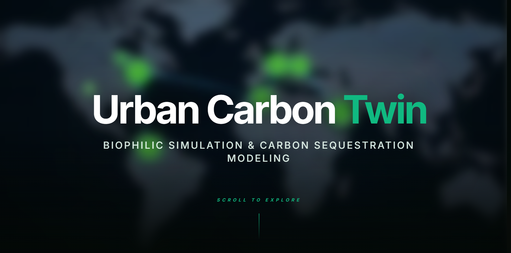
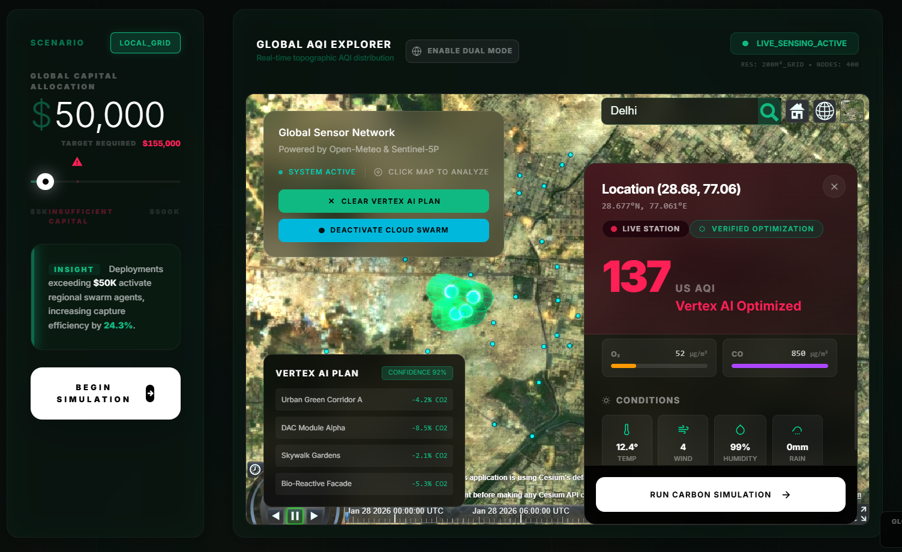
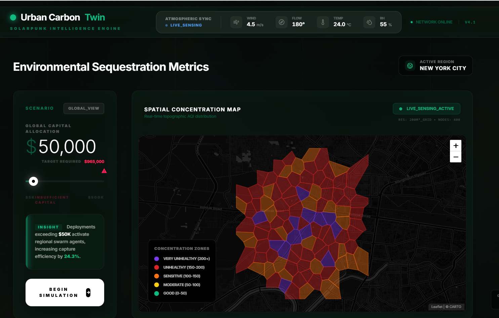
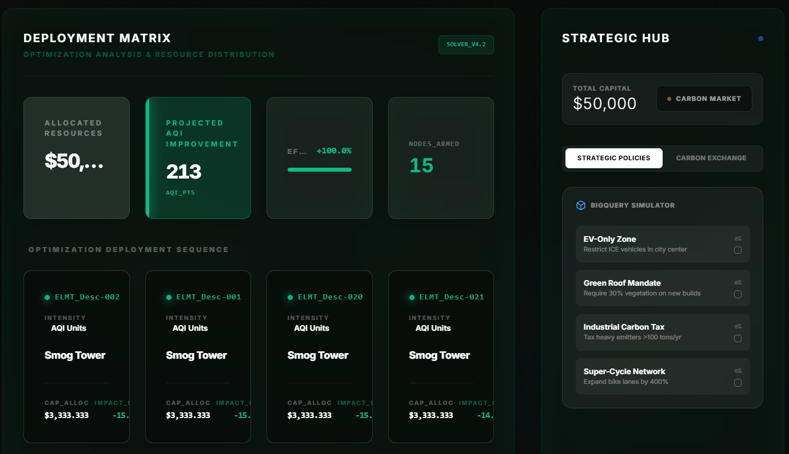
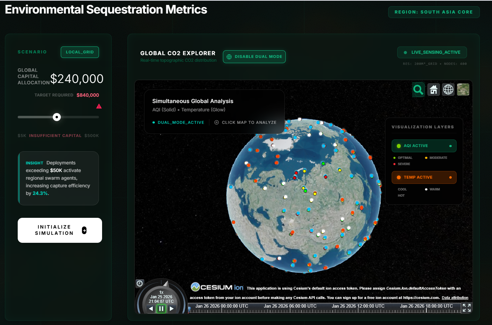
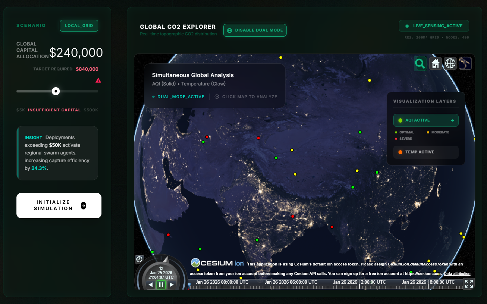
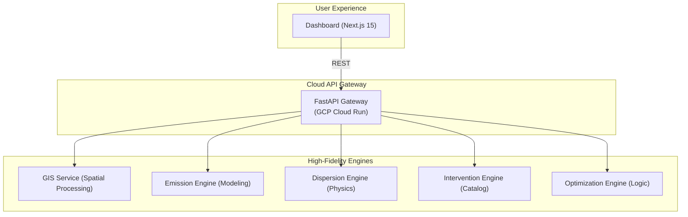

# Urban Carbon Twin 🏙️🌌✨
### An Advanced Digital Twin Platform for Urban CO₂ Modeling & Optimization


---

## 📌 Project Vision

**Urban Carbon Twin** is a high-fidelity, microservices-powered **digital twin platform** engineered to simulate, visualize, and optimize urban carbon sequestration. By creating a precise virtual replica of urban environments, the platform empowers city planners and environmental teams to test mitigation strategies in a **low-risk, high-intelligence environment** before real-world implementation.

---

## 🖼️ UI Preview & Live Demo

| [  ](https://urban-carbon-twin.vercel.app) | [  ](https://urban-carbon-twin.vercel.app) | [  ](https://urban-carbon-twin.vercel.app) |
| :---: | :---: | :---: |
| **Interactive Landing** | **3D Topology Map** | **Resource Logic** |
| [  ](https://urban-carbon-twin.vercel.app) | [  ](https://urban-carbon-twin.vercel.app) | [  ](https://urban-carbon-twin.vercel.app) |
| **Scenario Intel** | **Live Metrics** | **Carbon Exchange** |
| [  ](https://urban-carbon-twin.vercel.app) | | |
| **Policy Sandbox** | | |

> [!IMPORTANT]
> **🚀 Live Experience**: Click any image above to explore the **[Urban Carbon Twin Live Deployment](https://urban-carbon-twin.vercel.app)**.

---

## ⚡ Key Pillars

| 🧩 Visibility | 🧠 Intelligence | 📈 Optimization |
| :--- | :--- | :--- |
| **Real-time GIS Sync** integrates spatial data into a high-performance 3D dashboard. | **Physics-based Dispersion** models the micro-climatic flow of CO₂ across street layouts. | **Cost-Aware Interventions** use AI to find the most efficient budget allocation. |

---

---

## 🧠 System Architecture

Urban Carbon Twin utilizes a **decoupled microservice architecture** for maximum scalability and reliability.





### 🛠️ Service Directory

| Service | Responsibility | Technology |
| :--- | :--- | :--- |
| **Frontend** | Premium Dashboard UI & 3D Visuals | Next.js 15, Tailwind v4, Lucide |
| **API Gateway** | Request Orchestration & Security | FastAPI, GCP Cloud Run |
| **GIS Service** | Street Layout & Building Footprints | Python, GeoJSON |
| **Emission Engine**| Traffic & Point-source computation | Python, Scientific Computing |
| **Dispersion Engine**| CO₂ Micro-flow simulation | Python, Physics Models |
| **Optimization Engine**| Budget allocation logic | Python, Linear Optimization |

---

## 🚀 Technical Stack

- **Frontend**: Next.js 15, React 19, **Tailwind CSS v4**, Lucide-React.
- **Backend**: Python 3.12, FastAPI, Pydantic, NumPy.
- **Infrastructure**: Docker, Docker Compose, Google Cloud Run, Vercel.
- **Architecture**: RESTful Microservices, Geo-spatial Data Processing.

---

## 🛠️ Quick Start

### 1. Launch with Docker (Recommended)
Clone the repository and spin up the entire microservice ecosystem:
```bash
git clone https://github.com/PrayasNASA/urban-carbon-twin.git
cd urban-carbon-twin
docker compose up --build
```

### 2. Manual Setup (Development)
If you prefer running services individually:
- **Backend Services**: Located in `/services`, each with its own `requirements.txt`.
- **Frontend Dashboard**: Located in `/frontend/next-dashboard`, run `npm install && npm run dev`.

### 3. Service Access
- **🌍 Experience Dashboard**: [http://localhost:3000](http://localhost:3000)
- **⚙️ Simulation Gateway**: [http://localhost:8005/docs](http://localhost:8005/docs)
- **📍 GIS Spatial Engine**: [http://localhost:8000/docs](http://localhost:8000/docs)

---

## 🧪 Interactive Simulation Guide

The **Urban Carbon Twin** dashboard provides a structured workflow for environmental planning:

1.  **Contextual Awareness**: Navigate the topographic map to understand current CO₂ distribution patterns across the urban grid.
2.  **Strategic Budgeting**: Use the **Scenario Intelligence** panel to define your intervention budget.
3.  **Engine Execution**: Click **"Initialize Simulation"**. The platform orchestrates multi-service logic to calculate physics-based dispersion and optimize resource placement.
4.  **Actionable Results**: Review the **Deployment Matrix** for specific, cost-effective sequestration strategies (e.g., Roadside Capture, Urban Reforestation).
5.  **Comparative Analysis**: Toggle **"Compare Mode"** to visualize improvements against baseline environmental data.

---
## 📜 License & Governance

- **Project Status**: ACTIVE - Developed for strategic urban resilience modeling.
- **Theme**: Digital Twin for Sustainability & Decarbonization.
- **Context**: Hack-4-Viksit Bharat Hackathon
