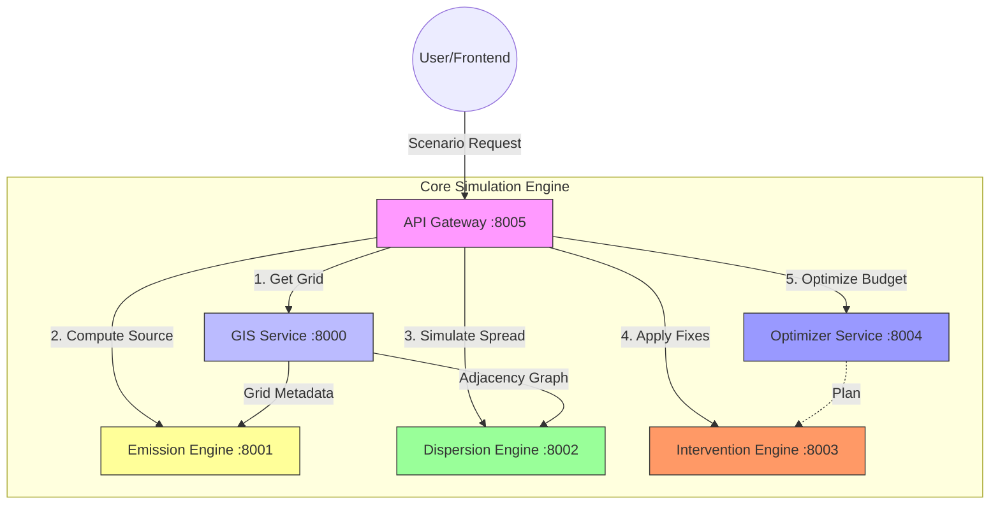

# Urban Carbon Twin  
### A Digital Twin Platform for Urban CO₂ Modeling & Mitigation

---

## 📌 Project Overview

**Urban Carbon Twin** is a microservices-based **digital twin platform** designed to model, simulate, and optimize **CO₂ emissions, dispersion, and mitigation strategies** in urban environments.

The platform enables planners, researchers, and sustainability teams to **analyze urban carbon dynamics digitally**, test mitigation strategies virtually, and make **data-driven decisions** before real-world deployment.


---

## 🌍 Why Urban Carbon Twin

Modern cities face complex challenges related to:
- Traffic-driven emissions
- Dense urban infrastructure
- Limited space for physical experimentation
- High cost of trial-and-error interventions

Urban Carbon Twin provides a **virtual experimentation environment** where different emission scenarios and mitigation strategies can be tested safely and efficiently.

---

## 🎯 Core Objectives

- Create a **grid-based digital representation** of an urban area
- Model **CO₂ emissions** from roads, buildings, and baseline sources
- Simulate **pollution dispersion** across spatial neighborhoods
- Apply **carbon capture and mitigation interventions** digitally
- Optimize intervention placement under **budget constraints**
- Provide a **single scenario API** for dashboards and analytics tools

---

## 🧠 Platform Architecture

The system is built using **loosely coupled microservices**, each responsible for a specific domain:



### Microservices Definition

| Service | Port | Description |
| :--- | :--- | :--- |
| **GIS Service** | `8000` | Generates grid, road network, and spatial adjacency graphs. |
| **Emission Engine** | `8001` | Calculates base emissions based on traffic and building data. |
| **Dispersion Engine** | `8002` | Simulates CO₂ spread to neighboring grids over time. |
| **Intervention Engine** | `8003` | Simulates impact of Green Walls, Filters, etc. |
| **Optimizer Service** | `8004` | Determines best intervention mix for a given budget. |
| **API Gateway** | `8005` | Orchestrates the entire pipeline. |

---

## 🚀 Quick Start

### Prerequisites
- [Docker Desktop](https://www.docker.com/products/docker-desktop)
- [Git](https://git-scm.com/)

### Installation & Running

1. **Clone the Repository**
   ```bash
   git clone https://github.com/your-username/urban-carbon-twin.git
   cd urban-carbon-twin
   ```

2. **Start All Services**
   The entire system is containerized. Run:
   ```bash
   docker compose up --build
   ```

3. **Access the Application**
   - **Frontend Dashboard**: [http://localhost:3000](http://localhost:3000)
   - **API Documentation**: [http://localhost:8005/docs](http://localhost:8005/docs)

---

## 🧪 API Usage

You can interact directly with the simulation engine via the API Gateway.

### Run a Scenario

**Endpoint:** `POST /scenario`

**Request:**
```json
{
  "budget": 50000,
  "interventions": [] 
}
```

**Response:**
```json
{
  "emissions": { ... },
  "dispersion": { ... },
  "optimization_plan": {
    "total_cost": 48000,
    "plan": [
      { "grid_id": "1_1", "intervention": "roadside_capture", "units": 2 }
    ]
  },
  "post_intervention": { ... }
}
```

---

## 🧩 Grid-Based Digital Twin Concept

The **grid** is the core entity across the entire system.

Each grid represents:
- Emission intensity
- Pollution concentration
- Dispersion behavior
- Intervention impact
- Optimization priority

This approach ensures:
- Consistent data flow across services
- Scalable simulations for large cities
- Easy visualization via heatmaps and dashboards

---

## 📊 Frontend Features

The project includes a **Next.js 15** dashboard with premium styling:
- **Glassmorphism UI**: Modern, translucent aesthetics.
- **3D Grid Visualization**: Interactive city grid with tilt/rotate.
- **Real-time Results**: Instant feedback from the simulation engine.

---

## 👥 Team

- **Team Name:** [Your Team Name]
- **Project Theme:** Digital Twin for Urban CO₂ Capture  

---

## 📜 License

This project is developed for academic and demonstration purposes.